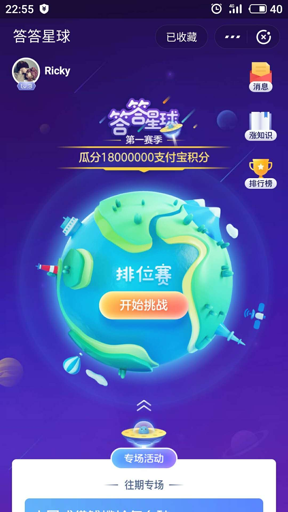
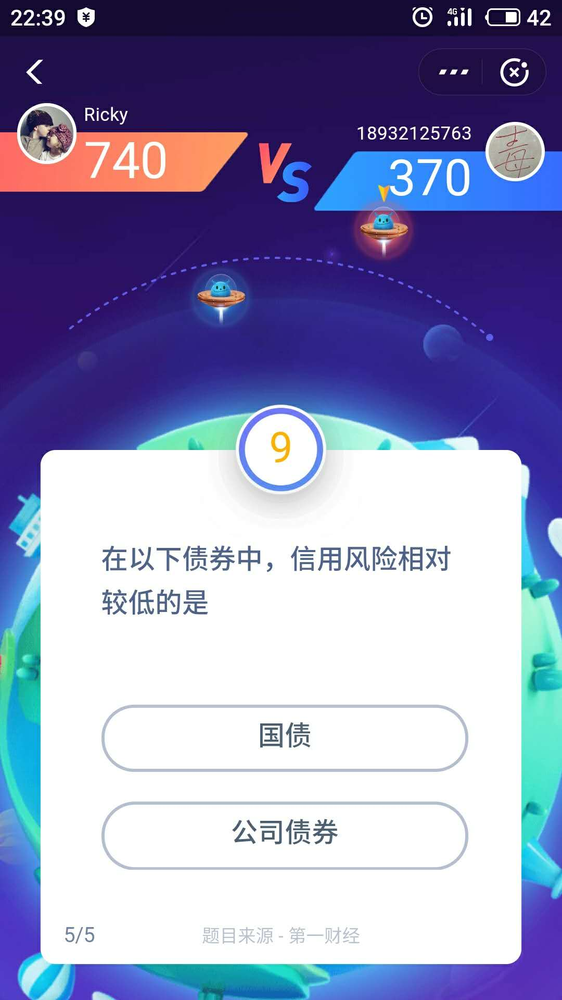

## 业务场景
在了解系统设计方案和架构之前，先看看直播答题应用有哪些核心功能？下面是APP端的几张产品截图：

功能包括以下：
1. 答题以活动的形式展开，每场活动都会预先公布直播开始时间、答题总奖金、红包雨奖金等信息。
2. 活动时间到后，用户就可以进入直播间，看到实时的视频流，有专业的主持人进行串词口播，场控人员会配合主持人同步进行发题、公布答案等操作。
3. 题目下发后，用户有10秒的作答时间，答错或者超时即退出游戏，如果用户有复活道具在答错时会自动使用，用户能继续进行答题。
4. 为了留住答错用户，活动期间有多场**红包雨**，用户点击屏幕就有概率抢到。
5. 活动期间用户可**发弹幕**，同时会有弹幕滚屏轮播，以营造热闹的直播氛围。
6. 其他功能：邀请新人、活动榜单、奖金提现等。

其他直播类应用在产品功能上和直播答题类似，基本也是这两类：
1. 直播的基础功能：连麦互动直播（支持多码率、多协议，多主播同框）、美颜特效、弹幕、IM聊天、点赞、屏幕共享等功能性需求，以及防盗链、涉黄涉政鉴别等非功能性需求。
2. 应用本身的个性化功能：比如答题场景中的发题目、作答、公布答案，电商场景中的商品展示、一键下单购买，网红直播场景中的礼物打赏。

## 应用案例
支付宝最近刚推出了一个新活动: 问答星球，流程如下：

