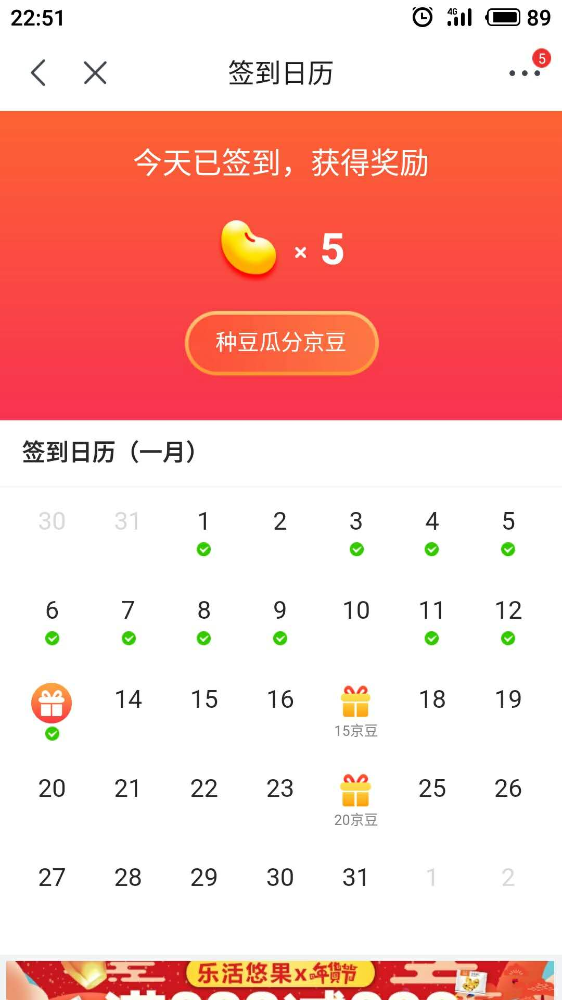

## 应用场景
例如 某东的用户签到：


签到后：



## 表结构设计
```
CREATE TABLE `user_sign_in` (
  `id` bigint(20) unsigned NOT NULL AUTO_INCREMENT COMMENT '主键',
  `user_id` bigint(20) unsigned NOT NULL COMMENT '用户id',
  `nickname` varchar(45) NOT NULL COMMENT '用户昵称',
  `last_sign_in_date` int(10) unsigned NOT NULL COMMENT '最近一次签到日期，格式: yyyyMMdd',
  `continuous_sign_in_days` int(10) unsigned NOT NULL COMMENT '连续签到天数',
  `version` int(10) unsigned NOT NULL DEFAULT 1 COMMENT '版本号',
  `create_time` datetime NOT NULL COMMENT '创建时间',
  `update_time` datetime NOT NULL COMMENT '更新时间',
  PRIMARY KEY (`id`),
  KEY `idx_user_id` (`user_id`)
) ENGINE=InnoDB DEFAULT CHARSET=utf8mb4 COMMENT='用户签到表';

CREATE TABLE `user_sign_in_log` (
  `id` bigint(20) unsigned NOT NULL AUTO_INCREMENT COMMENT '主键',
  `user_id` bigint(20) unsigned NOT NULL COMMENT '用户id',
  `sign_in_date` int(10) unsigned NOT NULL COMMENT '签到日期，格式: yyyyMMdd',
  `create_time` datetime NOT NULL COMMENT '创建时间',
  `update_time` datetime NOT NULL COMMENT '更新时间',
  PRIMARY KEY (`id`),
  UNIQUE KEY `uniq_user_id_sign_date` (`user_id`, `sign_in_date`)
) ENGINE=InnoDB DEFAULT CHARSET=utf8mb4 COMMENT='用户签到log表';
```

## API接口
### 1.用户当天签到状态查询
查询用户当天签到状态
#### 1.1 API Path
/api/user/sign-in/status
#### 1.2 请求方式
HTTP GET

#### 1.3 请求参数
无

#### 1.4 返回结果
```
{
    "code": 1, 
    "message": "OK", 
    "data": {
        "todaySignIn": 1, 
        "continuousSignInDays": 1
    }
}
```

### 2.用户签到接口
用户签到
#### 2.1 API Path
/api/user/sign-in/tick
#### 2.2 请求方式
HTTP GET

#### 2.3 请求参数
无

#### 1.4 返回结果
```
{
    "code": 1, 
    "message": "OK", 
    "data": {
        "continuousSignInDays": 1
    }
}
```

### 3.查询用户当月签到记录
查询用户当月签到记录
#### 3.1 API Path
/api/user/sign-in/history
#### 3.2 请求方式
HTTP GET

#### 3.3 请求参数
无

#### 3.4 返回结果
```
{
    "code": 1, 
    "message": "OK", 
    "data": {
        "startDay": 20190101, 
        "endDay": 20190131, 
        "signInList": [
            20190101, 
            20190102, 
            20190103, 
            20190104, 
            20190106, 
            20190107
        ]
    }
}
```
